# FPGA Real-Time Motion Detection System

Zynq-7000 FPGA 기반의 **3-Frame Difference 실시간 움직임 영역 검출 시스템**입니다.

Pcam 5C Demo의 카메라 입력 및 기본 Video I/O 구조를 기반으로,  
3개의 VDMA Read Channel을 이용한 Multi-Frame 구조와 Verilog RTL 기반 영상처리 Pipeline을 추가하여  
**1920×1080 30fps** 환경에서 움직임 영역을 실시간으로 검출하고 Bounding Box로 출력했습니다.

---

## 1. Project Overview

### Target

카메라 입력 영상에서 움직임 영역을 실시간으로 검출하고, 검출된 영역을 Bounding Box로 표시하는 FPGA 기반 영상처리 시스템 구현

### Development Environment

| Item | Description |
|---|---|
| FPGA Board | Digilent Zybo Z7-20 |
| SoC | Xilinx Zynq-7000 |
| Camera | Digilent Pcam 5C |
| HDL | Verilog HDL |
| Software | C |
| Tool | Vivado / Vitis |
| Interface | AXI4-Stream, AXI4-Lite, AXI VDMA |
| Resolution | 1920 × 1080 |
| Frame Rate | 30 fps |
| Processing Clock | 150 MHz |
| Streaming Throughput | 1 pixel/clk |

---

## 2. Implementation Scope

본 프로젝트는 **Vivado Pcam 5C Demo를 기반으로 확장**했습니다.

### Pcam Demo 기반 활용 영역

- Pcam 5C Camera Input
- MIPI D-PHY
- MIPI CSI-2 RX
- Bayer to RGB
- Gamma Correction
- 기본 Video Output 구조
- Zynq PS 및 Clock / Reset Infrastructure

### 직접 구현 및 확장한 영역

- 2-Frame Difference → **3-Frame Difference 구조 확장**
- 3개의 VDMA MM2S Read Channel을 이용한 Multi-Frame 공급 구조
- VDMA Genlock / Frame Delay 기반 Frame Synchronization
- Verilog RTL 기반 AXI4-Stream 영상처리 Pipeline
- RGB to Gray
- Frame Difference
- Threshold 기반 Motion Detection
- 3-Frame Motion OR
- 3×3 Morphology
- Bounding Box Calculation
- Bounding Box Overlay
- AXI4-Lite 기반 ROI Control
- Multi-VDMA Memory Path 구성 및 HP Port 분산
- AXI4-Stream Backpressure를 고려한 Pixel Alignment
- Vivado ILA 및 PS Software 기반 시스템 검증

---

## 3. 3-Frame Difference

기존 2-Frame Difference 방식은 연속된 두 프레임 사이의 변화만 반영하기 때문에  
빠른 움직임에서 검출 결과가 순간적으로 끊길 수 있습니다.

이를 개선하기 위해 연속된 세 프레임을 이용했습니다.

```text
D1 = |F(n)   - F(n-1)|
D2 = |F(n-1) - F(n-2)|

Motion = (D1 > Threshold) OR (D2 > Threshold)
```

두 Frame Difference 결과 중 하나에서 움직임이 검출되면 Motion 영역을 유지하도록 구성하여  
시간축에서의 검출 연속성을 높였습니다.

---

## 4. 3-VDMA Architecture

1080p Frame을 FPGA 내부 BRAM에 저장하는 대신 DDR Frame Buffer를 사용했습니다.

연속된 세 프레임을 동시에 처리하기 위해 3개의 AXI VDMA MM2S Read Channel을 구성했습니다.

- VDMA0 → Frame N
- VDMA1 → Frame N-1
- VDMA2 → Frame N-2

각 VDMA가 서로 다른 Frame을 읽도록 Genlock Master / Slave 설정과 Frame Delay 관련 Register를 이용해 동기화했습니다.

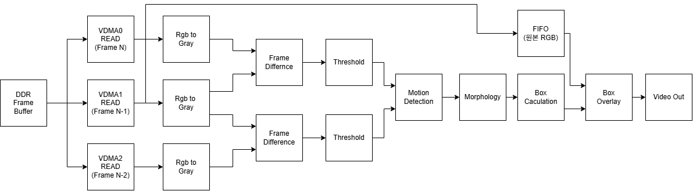

---

## 5. Vivado Implementation

### Full System Block Design

Pcam 입력부, DDR / VDMA, Custom RTL Pipeline, Video Output을 포함한 전체 Vivado Block Design입니다.

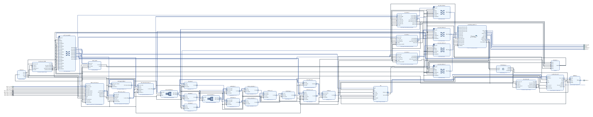

### Custom RTL Processing Pipeline

움직임 검출을 위해 구성한 AXI4-Stream 기반 Custom RTL Pipeline입니다.

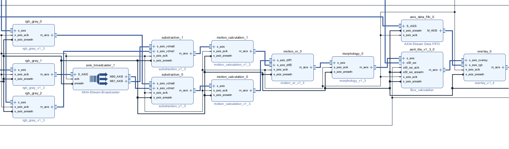

주요 처리 흐름은 다음과 같습니다.

```text
Frame N ───────┐
               ├─ Frame Difference ─┐
Frame N-1 ─────┤                    │
               │                    ├─ Motion OR
               └─ Frame Difference ─┤
Frame N-2 ──────────────────────────┘
                                    │
                                    ▼
                               Morphology
                                    │
                                    ▼
                            Bounding Box
                                    │
                                    ▼
                                 Overlay
```

### Multi-VDMA Memory Structure

3개의 VDMA Read Channel을 통해 DDR Frame Buffer의 연속 Frame을 공급하도록 구성했습니다.

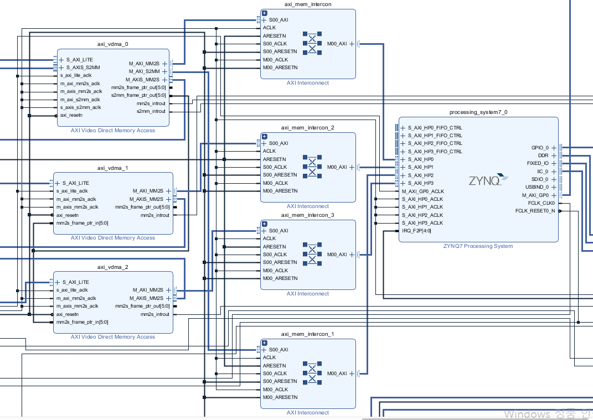

---

## 6. Custom RTL Modules

```text
rtl/
├── rgb_to_gray/
│   └── rgb_to_gray.v
│
├── frame_difference/
│   └── substraction.v
│
├── motion/
│   ├── motion_calculation.v
│   └── motion_or.v
│
├── morphology/
│   ├── morphology.v
│   ├── window.v
│   ├── erosion.v
│   ├── dilation.v
│   └── dpbram.v
│
├── box_calculation/
│   ├── axi4_lite_v1_0.v
│   ├── axi4_lite_v1_0_S00_AXI.v
│   └── box_cal.v
│
└── overlay/
    └── overlay.v
```

### Pipeline Performance

정상적인 `TVALID / TREADY` 상태를 기준으로 각 Pipeline Stage는 1 pixel/clk의 처리량을 갖도록 구성했습니다.

| Processing Block | Latency | Throughput |
|---|---:|---:|
| RGB to Gray | 1 clk | 1 pixel/clk |
| Frame Difference | 1 clk | 1 pixel/clk |
| Threshold | 1 clk | 1 pixel/clk |
| Motion Calculation | 1 clk | 1 pixel/clk |
| Morphology | 7 clk | 1 pixel/clk |
| Box Calculation | 2 clk | 1 pixel/clk |
| Overlay | 1 clk | 1 pixel/clk |
| **Total** | **14 clk** | **1 pixel/clk** |

---

## 7. AXI4-Lite ROI Control

Bounding Box를 검출할 영역을 PS에서 설정할 수 있도록 AXI4-Lite Interface를 구성했습니다.

PS에서 ROI 좌표를 Register에 설정하고,  
PL의 Box Calculation Logic은 지정된 ROI 내부에서 움직임 Pixel의 최소 / 최대 좌표를 계산하여 Bounding Box를 생성합니다.

---

## 8. Troubleshooting

### 8.1 Multi-VDMA Memory Path Bottleneck

3-Frame 구조로 확장하면서 3개의 VDMA Read Channel이 동시에 DDR에 접근하게 되었습니다.

초기에는 여러 Read Channel을 단일 HP Path에 연결했으며,  
ILA를 이용하여 AXI4-Stream 전송 상태를 관측한 결과 Burst 사이에 공백이 발생했습니다.

1024 Sample 관측 구간을 기준으로 약 **85.6%의 전송률**을 확인했습니다.

#### Before: Single HP Path

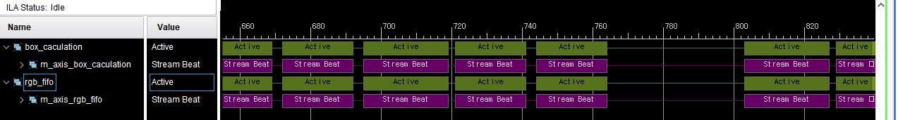

이를 해결하기 위해 각 VDMA의 Memory Access Path를 여러 HP Port로 분산하여  
단일 Path에서 발생하던 Arbitration과 전송 집중을 완화했습니다.

#### After: Distributed HP Paths

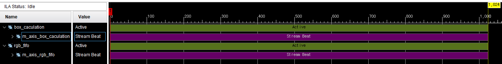

포트 분리 후 동일한 1024 Sample 관측 구간에서 연속적인 Stream 전송을 확인했으며,  
영상 출력이 안정화되었습니다.

---

### 8.2 RGB / Processing Result Pixel Alignment

Overlay IP에는 다음 두 경로의 데이터가 동시에 입력됩니다.

```text
Original RGB Path
        │
        └───────────────┐
                        ▼
                     Overlay
                        ▲
                        │
Motion Processing → Bounding Box
```

Motion Processing Path에는 고정적인 Pipeline Latency가 존재합니다.

하지만 실제 AXI4-Stream 환경에서는 Backpressure에 의해 Stall이 발생할 수 있기 때문에  
RGB Path와 Processing Path 사이의 시간 차이가 항상 일정하지 않았습니다.

따라서 단순한 Shift Register 기반 고정 Delay만으로는 동일 좌표의 Pixel을 안정적으로 정렬할 수 없었습니다.

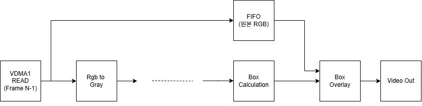

이를 해결하기 위해 Original RGB Path에 **AXI4-Stream Data FIFO**를 적용하고,  
Overlay 단계에서 두 입력의 `TVALID / TREADY` 상태를 기준으로 데이터를 전달하도록 Handshake를 제어했습니다.

---

### 8.3 Morphology Boundary Handling

3×3 Morphology 연산에서는 영상 경계 Pixel의 경우 Window를 구성하는 일부 이웃 Pixel이 존재하지 않습니다.

경계 Pixel을 단순히 제외하면 출력 영상의 크기가 감소하기 때문에 별도의 경계 처리가 필요했습니다.

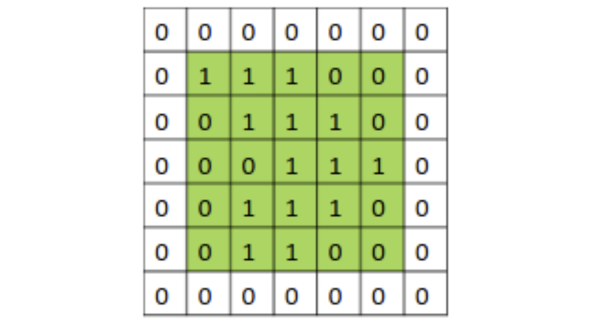

영상 외부 영역의 Pixel 값을 `0`으로 가정하는 **Zero Padding**을 적용하여  
경계에서도 3×3 Window 연산을 수행하면서 입력과 동일한 해상도를 유지했습니다.

---

## 9. Verification

### FPGA Logic Verification

Custom RTL은 Simulation을 통해 기능을 확인한 뒤 전체 시스템에 통합했습니다.

실제 FPGA에서는 Vivado ILA를 이용하여 각 Processing Stage의 AXI4-Stream Data Flow와 Pipeline 동작을 확인했습니다.

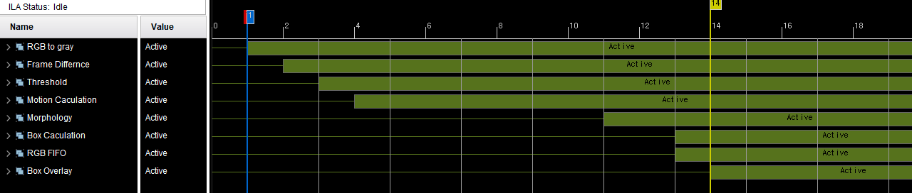

### VDMA Synchronization Verification

PS Software에서 VDMA Frame Address 및 Frame Pointer를 확인하여  
각 Read Channel이 의도한 Frame Buffer에 접근하는지 검증했습니다.

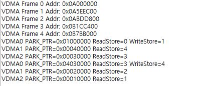

---

## 10. Result

최종적으로 **1920×1080 @ 30fps** 영상에서 움직임 영역을 실시간으로 검출하고  
Bounding Box를 안정적으로 출력했습니다.

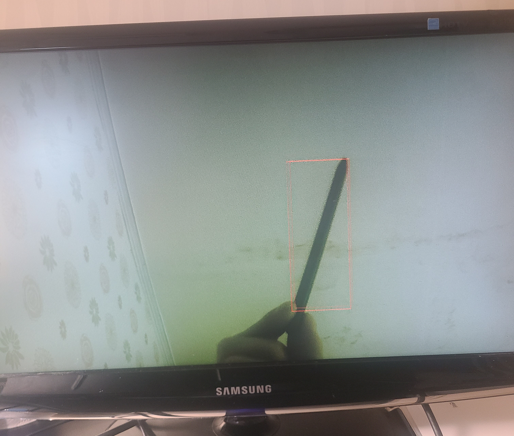

Hardware Setup 사진은 추후 추가할 예정입니다.

---

## 11. Repository Structure

```text
FPGA-RealTime-Motion-Detection/
├── README.md
│
├── docs/
│   ├── 3vdma_architecture_block_diagram.png
│   ├── system_bd.png
│   ├── custom_motion_pipeline_bd.png
│   ├── multi_vdma_structure.png
│   ├── axis_handshake_with_stall.png
│   ├── axis_handshake_continuous.png
│   ├── pixel_alignment_architecture.png
│   ├── morphology_zero_padding.png
│   ├── ila_pipeline_latency.png
│   ├── vdma_sync_verification.png
│   └── final_output.png
│
└── rtl/
    ├── rgb_to_gray/
    │   └── rgb_to_gray.v
    │
    ├── frame_difference/
    │   └── substraction.v
    │
    ├── motion/
    │   ├── motion_calculation.v
    │   └── motion_or.v
    │
    ├── morphology/
    │   ├── morphology.v
    │   ├── window.v
    │   ├── erosion.v
    │   ├── dilation.v
    │   └── dpbram.v
    │
    ├── box_calculation/
    │   ├── axi4_lite_v1_0.v
    │   ├── axi4_lite_v1_0_S00_AXI.v
    │   └── box_cal.v
    │
    └── overlay/
        └── overlay.v
```
