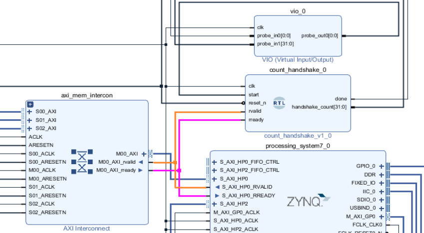
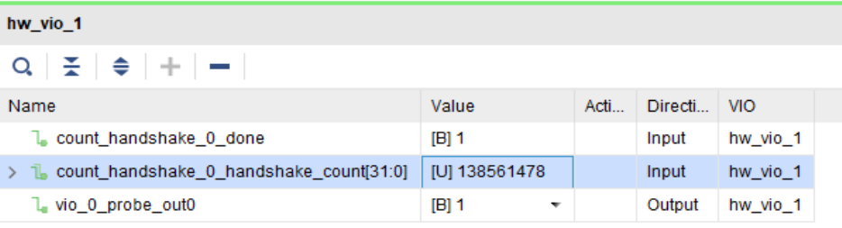
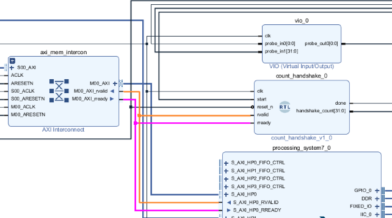
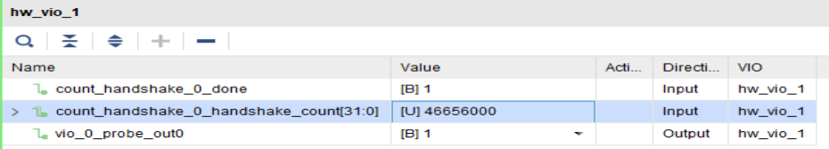
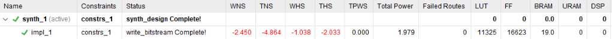

# FPGA Real-Time Motion Detection System

Zynq-7000 FPGA 기반 3-Frame Difference 실시간 움직임 영역 검출 시스템

Digilent Pcam 5C Demo의 카메라 입력 및 기본 Video I/O 구조를 기반으로,
AXI4-Stream 영상처리 RTL과 3개의 VDMA MM2S Read Channel을 이용한 3-Frame 처리 구조를 구성하고
1920×1080 30fps 영상에서 움직임 영역을 검출하여 Bounding Box로 출력했습니다.

### 주요 구현 및 성과

- AXI4-Stream 기반 3-Frame Difference 영상처리 RTL 설계
- 3개의 VDMA MM2S Read Channel 기반 3-Frame 처리 구조
- AXIS FIFO 기반 원본 영상과 처리 결과의 픽셀 정렬
- VDMA Read Channel의 HP Port 분산
- 1920×1080 30fps 실시간 영상 처리
- 150 MHz 환경에서 Custom RTL 타이밍 검증

---

## 1. 개발 환경

| 구분 | 내용 |
|---|---|
| 보드 | Digilent Zybo Z7-20 |
| SoC | Xilinx Zynq-7000 |
| 카메라 | Digilent Pcam 5C |
| HDL | Verilog HDL |
| PS 소프트웨어 | C |
| 개발 환경 | Vivado / Vitis 2020.1 |
| 주요 인터페이스 / IP | AXI4-Stream, AXI4-Lite, AXI VDMA |
| 카메라 입력 | 1920×1080 30fps |
| 디스플레이 출력 | 1920×1080 60Hz |
| Custom RTL 클럭 | 150 MHz |

---

## 2. 구현 범위

Pcam 5C Demo의 카메라 입력과 기본 Video I/O 구조를 활용하고,
영상처리 RTL과 3-Frame 처리 구조를 직접 구성했습니다.

### Reference Design 활용

- Pcam 5C Camera 초기화 및 기본 Video Input / Output Pipeline

### 직접 설계 및 구성

- 3-Frame Difference 기반 AXI4-Stream 영상처리 RTL
- 3×3 Morphology 및 Bounding Box Overlay
- AXI4-Lite 기반 ROI Control Interface
- 3개의 VDMA MM2S Read Channel 기반 3-Frame 처리 구조
- Frame Delay / Genlock 기반 프레임 동기화
- AXIS FIFO 기반 픽셀 정렬
- VDMA Read Channel의 HP Port 분산

### PS / PL 역할

| 영역 | 역할 |
|---|---|
| PS | Pcam Demo 제공 SW 기반 Camera 초기화, VDMA 설정, Frame Delay / Genlock 설정, ROI 제어 |
| PL | AXI4-Stream 기반 영상처리 RTL, 3-Frame Difference, Morphology, Bounding Box, Overlay |

---

## 3. 영상처리 알고리즘

### 3-Frame Difference

2-Frame Difference 방식에서 빠른 움직임이 특정 프레임 구간에서
순간적으로 누락될 수 있는 점을 보완하기 위해 연속된 세 프레임을 사용했습니다.

```text
D1 = |F(n)   - F(n-1)|
D2 = |F(n-1) - F(n-2)|

Motion = (D1 > Threshold) OR (D2 > Threshold)
```

두 차분 결과를 OR하여 어느 한 구간에서 움직임이 검출되면
Motion 영역이 유지되도록 구성했습니다.

이후 Binary Motion Mask에 3×3 Erosion과 Dilation을 적용해 작은 잡음 영역을 제거하고,
ROI 내부 Motion Pixel의 최소/최대 좌표를 이용해 Bounding Box를 생성했습니다.

### 영상처리 파이프라인

```text
RGB
 ↓
RGB to Gray
 ↓
Frame Difference
 ↓
Threshold
 ↓
3-Frame Motion Calculation
 ↓
3×3 Erosion
 ↓
3×3 Dilation
 ↓
Bounding Box Calculation
 ↓
Overlay
```

---

## 4. 시스템 구조

1080p 영상을 프레임 단위로 저장하고 처리하기 위해 DDR Frame Buffer를 사용했습니다.

연속된 세 프레임을 영상처리 RTL에 동시에 공급하기 위해
3개의 VDMA MM2S Read Channel을 구성했습니다.

- VDMA0 → Frame N
- VDMA1 → Frame N-1
- VDMA2 → Frame N-2
- VDMA의 Frame Delay / Genlock을 이용한 프레임 동기화
- DDR Frame Buffer 기반 3-Frame 처리

### 3-VDMA Pipeline Architecture

<p align="center">
  
</p>

### Vivado Block Design

<p align="center">
  
</p>

### Custom RTL Pipeline

<p align="center">
  
</p>

### VDMA / HP Port 구조

<p align="center">
  
</p>

---

## 5. Latency / Throughput

정상적인 `TVALID / TREADY` Handshake 상태에서
영상처리 파이프라인은 1 pixel/clk로 데이터를 처리하도록 설계했습니다.

| IP | 기능 | Latency | Throughput |
|---|---|---:|---:|
| RGB to Gray | RGB888 → 8-bit Gray | 1 clk | 1 pixel/clk |
| Frame Difference | 프레임 간 Pixel 차분 | 1 clk | 1 pixel/clk |
| Threshold | Binary Motion Mask 생성 | 1 clk | 1 pixel/clk |
| Motion Calculation | 두 Binary Mask OR 연산 | 1 clk | 1 pixel/clk |
| Morphology | 3×3 Erosion → Dilation | 7 clk | 1 pixel/clk |
| Box Calculation | ROI 내부 Bounding Box 좌표 계산 | 2 clk | 1 pixel/clk |
| Overlay | 원본 RGB에 Bounding Box 표시 | 1 clk | 1 pixel/clk |
| Total |  | 14 clk | 1 pixel/clk |

### 성능 결과

| 항목 | 결과 |
|---|---:|
| Custom RTL 클럭 | 150 MHz |
| 파이프라인 Latency | 14 clk / 93.3 ns |
| Throughput | 1 pixel/clk |
| 영상 출력 | 1920×1080 30fps |

---

## 6. 트러블슈팅

### 6.1 단일 HP0 공유에 따른 메모리 대역폭 병목

#### 1. 문제 및 데이터 흐름 점검

2-Frame에서 3-Frame 처리 구조로 확장하면서
VDMA MM2S Read Channel을 2개에서 3개로 늘렸습니다.

초기에는 세 Read Channel을 하나의 AXI Interconnect를 통해 HP0에 연결했으나,
영상이 정상적으로 출력되지 않았습니다.

```text
VDMA0 Read ─┐
VDMA1 Read ─┼─ AXI Interconnect ─ HP0 ─ DDR
VDMA2 Read ─┘
```

Vivado ILA로 영상처리 Pipeline을 단계적으로 확인한 결과,
여러 AXI4-Stream 구간에서 데이터 전송 공백을 확인했습니다.

아래는 Overlay 입력에서 관측한 대표 파형입니다.

<p align="center">
  
</p>

---

#### 2. 요구 대역폭 분석

디스플레이 출력: 1920×1080 60Hz, RGB888

```text
1개의 Read Channel 요구 대역폭
= 1920 × 1080 × 60 × 3 Byte
= 373.248 MB/s

3개의 Read Channel 요구 대역폭
= 373.248 × 3
= 1,119.744 MB/s

HP Port 이론 대역폭
= 150 MHz × 8 Byte
= 1,200 MB/s

HP Port 이론 대역폭 대비 요구량
= 1,119.744 / 1,200 × 100
= 93.312%
```

세 Read Channel의 합산 요구량이 단일 HP Port 이론 대역폭의 약 93.3%를 차지해,
대역폭 여유가 크지 않은 구조임을 확인했습니다.

---

#### 3. 단일 HP0 전송 대역폭 측정

##### 측정 방법

HP0 Read Data Channel의 `RVALID`, `RREADY`를 RTL Counter에 연결하고,
`RVALID && RREADY`가 성립한 Cycle을 1초 동안 Count했습니다.

64-bit Data Width를 기준으로 Handshake 1회당 8 Byte로 계산했습니다.

| 신호 | 의미 |
|---|---|
| `RVALID` | 유효한 Read Data 전달 |
| `RREADY` | Read Data 수신 가능 |
| `RVALID && RREADY` | 실제 Read Data 전송 |
| `start` | 측정 시작 |
| `done` | 측정 완료 |
| `handshake_count` | 1초 동안 발생한 Read Data 전송 횟수 |

##### 측정 구성

HP0의 `RVALID / RREADY`를 RTL Counter에 연결한 전송량 측정 구성

<p align="center">
  
</p>

##### 측정 결과

1초 동안의 `RVALID && RREADY` Handshake Count 확인

```text
handshake_count = 138,561,478
```

<p align="center">
  
</p>

##### 측정 결과 분석

실제 전송률

```text
138,561,478 / 150,000,000 × 100
= 92.374%
```

실제 전송 대역폭

```text
138,561,478 × 8 Byte
= 1,108.492 MB/s
```

3개의 VDMA Read Channel 요구 대역폭

```text
요구 대역폭 : 1,119.744 MB/s
측정 대역폭 : 1,108.492 MB/s
차이        :    11.252 MB/s
```

3개의 Read Channel이 요구하는 1,119.744 MB/s에 비해
실제 측정 대역폭은 1,108.492 MB/s로 약 11.25 MB/s 부족했습니다.

ILA에서 확인한 AXI4-Stream 전송 공백과 전송 대역폭 측정 결과를 바탕으로,
단일 HP0의 메모리 대역폭 병목으로 판단했습니다.

---

#### 4. HP Port 분산

세 VDMA Read Channel을 서로 다른 HP Port로 분산했습니다.

```text
VDMA0 Read  ─ HP0
VDMA1 Read  ─ HP1
VDMA2 Read  ─ HP3

VDMA0 Write ─ HP2
```

---

#### 5. HP Port 분산 후 전송 대역폭 측정

##### 측정 구성

HP Port 분산 후 HP0에 연결된 VDMA0 Read Channel의 전송량 측정 구성

<p align="center">
  
</p>

##### 측정 결과

1초 동안의 `RVALID && RREADY` Handshake Count 확인

```text
handshake_count = 46,656,000
```

<p align="center">
  
</p>

##### 측정 결과 분석

실제 전송률

```text
46,656,000 / 150,000,000 × 100
= 31.104%
```

실제 전송 대역폭

```text
46,656,000 × 8 Byte
= 373.248 MB/s
```

1개의 VDMA Read Channel 요구 대역폭

```text
요구 대역폭 : 373.248 MB/s
측정 대역폭 : 373.248 MB/s
```

분산 후 HP0에서 측정된 전송 대역폭은
VDMA0 Read Channel의 요구 대역폭과 일치했습니다.

---

#### 6. AXI4-Stream 전송 결과

HP Port 분산 후 1920×1080 30fps 영상 출력 정상화

동일한 Overlay 입력에서 캡처한 1,024 Cycle 구간에서
연속적인 AXI4-Stream Handshake 확인

<p align="center">
  
</p>

---

#### 7. 구성별 비교

| 항목 | 단일 HP0 공유 | HP Port 분산 후 HP0 |
|---|---:|---:|
| 관측 대상 | VDMA Read 3개 | VDMA0 Read 1개 |
| 요구 대역폭 | 1.120 GB/s | 0.373 GB/s |
| 실제 전송 대역폭 | 1.108 GB/s | 0.373 GB/s |
| 실제 전송률 | 92.374% | 31.104% |
| AXI4-Stream | 전송 공백 발생 | 연속 전송 확인 |
| 영상 출력 | 미출력 | 정상 |

---

### 6.2 원본 영상과 처리 결과의 픽셀 정렬

**문제**

- 원본 RGB 영상과 영상처리 결과를 결합하는 과정에서 Pixel 위치 불일치 발생

<p align="center">
  
</p>

**분석**

- 원본 RGB 경로와 영상처리 경로 사이에 서로 다른 처리 지연 존재
- 초기에는 Shift Register 기반 고정 지연으로 Pixel 위치 정렬
- Vivado ILA에서 `TVALID / TREADY` 신호를 관측한 결과, AXI4-Stream Backpressure 발생 시 영상처리 경로에 추가적인 가변 지연이 발생함을 확인
- Backpressure에 따른 가변 지연을 처리하기 위해 고정 Delay 방식 대신 버퍼링 구조가 필요하다고 판단

**해결**

- 원본 RGB 경로의 Shift Register 기반 고정 지연 구조를 AXIS FIFO 기반 버퍼링 구조로 변경
- Overlay 단계에서 두 입력의 `TVALID / TREADY` 상태를 고려해 데이터 전달
- Backpressure 발생 시 FIFO를 통해 원본 Pixel의 전달 시점 제어

**결과**

- Backpressure 발생 상황에서도 원본 영상과 영상처리 결과의 Pixel Sequence 정렬 유지

---

### 6.3 Morphology 경계 처리

**문제**

- 3×3 Morphology 연산 시 영상 가장자리에서 일부 이웃 Pixel 부재
- 경계 Pixel을 제외하면 출력 영상 크기가 입력보다 작아짐

**해결**

- 영상 외부 Pixel 값을 `0`으로 처리하는 Zero Padding 적용
- 영상 경계에서도 3×3 Window 연산 수행
- 입력과 동일한 출력 해상도 유지

<p align="center">
  
</p>

### 6.2 원본 영상과 처리 결과의 픽셀 정렬

**문제**

- 원본 RGB 영상과 영상처리 결과를 결합하는 과정에서 Pixel 위치 불일치 발생

<p align="center">
  
</p>

**분석**

- 원본 RGB 경로와 영상처리 경로 사이에 서로 다른 처리 지연 존재
- 초기에는 Shift Register 기반 고정 지연으로 Pixel 위치 정렬
- Vivado ILA에서 `TVALID / TREADY` 신호를 관측한 결과, AXI4-Stream Backpressure 발생 시 영상처리 경로에 추가적인 가변 지연이 발생함을 확인
- Backpressure에 따른 가변 지연을 처리하기 위해 고정 Delay 방식 대신 버퍼링 구조가 필요하다고 판단

**해결**

- 원본 RGB 경로의 Shift Register 기반 고정 지연 구조를 AXIS FIFO 기반 버퍼링 구조로 변경
- Overlay 단계에서 두 입력의 `TVALID / TREADY` 상태를 고려해 데이터 전달
- Backpressure 발생 시 FIFO를 통해 원본 Pixel의 전달 시점 제어

**결과**

- Backpressure 발생 상황에서도 원본 영상과 영상처리 결과의 Pixel Sequence 정렬 유지

---

### 6.3 Morphology 경계 처리

**문제**

- 3×3 Morphology 연산 시 영상 가장자리에서 일부 이웃 Pixel 부재
- 경계 Pixel을 제외하면 출력 영상 크기가 입력보다 작아짐

**해결**

- 영상 외부 Pixel 값을 `0`으로 처리하는 Zero Padding 적용
- 영상 경계에서도 3×3 Window 연산 수행
- 입력과 동일한 출력 해상도 유지

<p align="center">
  
</p>

---

## 7. 시스템 검증

### 시스템 통합 및 AXI4-Stream 검증

영상처리 RTL을 FPGA 시스템에 통합한 뒤,
Vivado ILA를 활용하여 실제 데이터 흐름과 인터페이스 동작을 검증했습니다.

- `TVALID / TREADY` Handshake
- 영상 데이터 흐름
- 파이프라인 지연
- Backpressure 발생 상태
- HP Port 분산 전후 Stream 전송 상태

<p align="center">
  
</p>

### VDMA 프레임 동기화 검증

PS Software를 통해 각 VDMA의 프레임 동작 상태를 확인하고,
3개의 MM2S Channel이 의도한 프레임을 공급하는지 검증했습니다.

- 각 VDMA의 프레임 동작 상태 확인
- Frame Delay 설정 확인
- Genlock 동작 확인
- 연속된 3개의 프레임이 영상처리 파이프라인에 공급되는지 검증

<p align="center">
  
</p>

---

## 8. 타이밍 / 자원 사용량

<p align="center">
  
</p>

| 항목 | 결과 |
|---|---:|
| WNS | -2.450 ns |
| TNS | -4.864 ns |
| WHS | -1.038 ns |
| THS | -2.033 ns |
| LUT | 11,325 |
| FF | 16,623 |
| BRAM | 19 |
| DSP | 0 |
| 총 소비전력 | 1.979 W |

전체 Design에는 Pcam Demo 기반 경로의 Negative Slack이 남아 있으며,
추가한 Custom RTL 경로에서는 타이밍 위반이 발생하지 않았습니다.

자원 사용량은 Pcam Demo와 Custom RTL을 포함한 전체 시스템 기준

---

## 9. 최종 결과

- 3-Frame Difference 기반 실시간 움직임 검출 RTL 구현
- 3개의 VDMA MM2S Read Channel 기반 3-Frame 처리 및 프레임 동기화
- AXIS FIFO 기반 원본 영상과 처리 결과의 픽셀 정렬
- HP Port 분산을 통한 메모리 대역폭 병목 완화 및 영상 출력 정상화
- Custom RTL 150 MHz 타이밍 검증
- 1920×1080 30fps Motion Detection 및 Bounding Box 실시간 출력

https://github.com/user-attachments/assets/9a3a67aa-2736-4b05-ba71-554f5b7c8f1a
